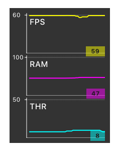

# ESMonitor
> A draggable system monitor inside your application.
> Shake to show.

[](http://forthebadge.com) [](http://forthebadge.com)

Compatible with:

- Swift 4
- Xcode 9
- Cocoapods 1.3

## Example



## Usage
```swift
#if DEBUG
    import ESMonitor
#endif

@UIApplicationMain
class AppDelegate: UIResponder, UIApplicationDelegate {

    var window: UIWindow?
    
    func application(_ application: UIApplication,
                     didFinishLaunchingWithOptions launchOptions: [UIApplicationLaunchOptionsKey: Any]?)
                      -> Bool {
        window?.rootViewController = MainViewController(nibName: nil, bundle: Bundle.main)
        window?.makeKeyAndVisible()
        #if DEBUG
            window?.addMonitor()
        #endif
        return true
    }
}
```

## Installation
### Cocoapods

```ruby
pod 'ESMonitor', :git => 'git@github.com:e-sites/ESMonitor.git', :configuration => 'Debug'
pod 'ESMonitorThreadCount', :git => 'git@github.com:e-sites/ESMonitor.git', :configuration => 'Debug'
```

## Settings

### `isDraggable (Bool)`
> Is the monitor view draggable

`Default: true`

### `position (Position)`
> The position of the monitor   

<table>
  <tr>
    <th colspan="3">Available positions</th>
  </tr>
  <tr>
	<td><code>.leftTop</code></td>
	<td><code>.centerTop</code></td>
	<td><code>.rightTop</code></td>
  </tr>
  <tr>
	<td><code>.leftCenter</code></td>
	<td>&nbsp;</td>
	<td><code>.rightCenter</code></td>
  </tr>
  <tr>
	<td><code>.leftBottom</code></td>
	<td><code>.centerBottom</code></td>
	<td><code>.rightBottom</code></td>
  </tr>
</table>

`Default: .rightTop`

### `refreshRate (TimeInterval)`
> At what interval should the monitors be refreshed?

`Default: 0.5`

### `width (CGFloat)`
> The width of the monitor view

`Default: 100`

### `graphHeight (CGFloat)`
> The height of each individual graph

`Default: 40`

### `instruments ([Instrument])`
> An array of all the instruments you would like to see in the monitor view.   
> See the [`Instrument protocol`](Source/Monitor/Instruments/Instrument.swift) for more information on making your own instrument / graph.

`Default: [ FramerateInstrument(), MemoryInstrument(), ThreadCountInstrument() ]`

## Functions

### `pause()`
> This would pause the plotting of the graphs

### `resume()`
> This would resume the plotting of the graphs